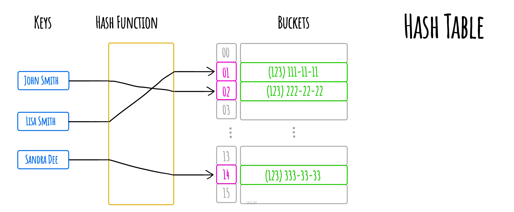
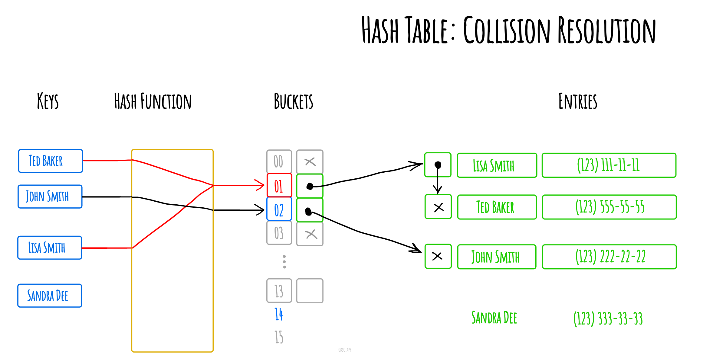
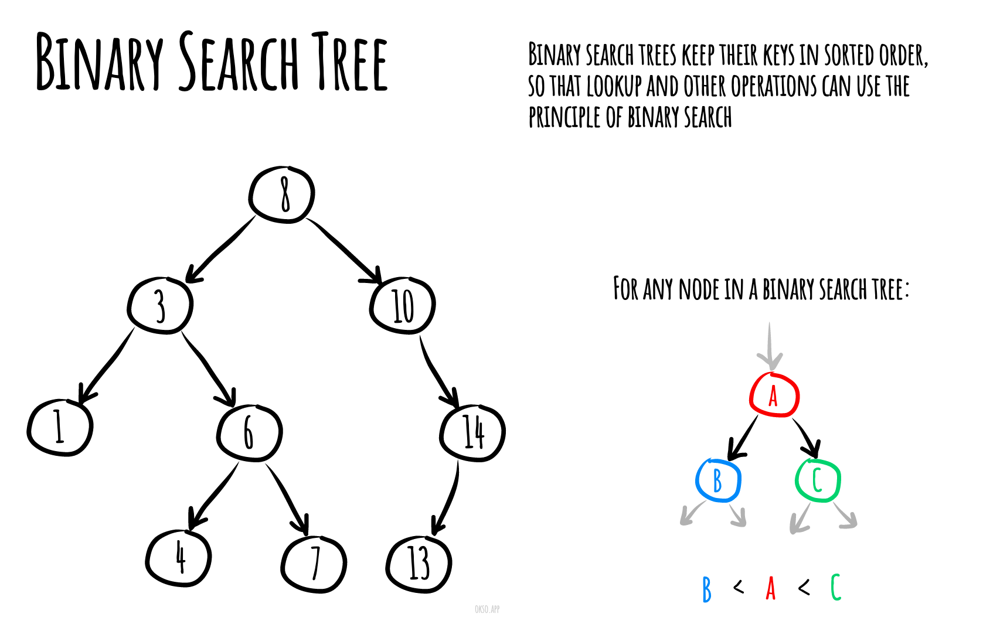

<div align="center">

</div>

# Data Structure

## 📑 INDEX

0. [HOME](./README.md)
1. [linked-list](#1-linked-list)
2. [doubly-linked-list](#2-doubly-linked-list)
3. [hash-table](#3-hash-table)
4. [queue](#4-queue)
5. [stack](#5-stack)
6. [tree](#6-tree)

---

## 1. Linked List

링크드 리스트는 데이터 요소의 선형 집합이다. 자바스크립트에서는 객체를 참조하는 방식으로 구현 가능하다.


```JavaScript
function Node(val) {
  this.val = val;
  this.next = null;
}

// 노드 생성
let head = new Node(0);
let node1 = new Node(1);
let node2 = new Node(2);

// 노드 연결
head.next = node1;
node1.next = node2;
```

### 시간 복잡도

| 접근 | 탐색 | 삽입 | 삭제 |
| :--: | :--: | :--: | :--: |
| O(n) | O(n) | O(1) | O(n) |

#### Reference

- [https://geniee.tistory.com/20](https://geniee.tistory.com/20)
- [https://github.com/trekhleb/javascript-algorithms](https://github.com/trekhleb/javascript-algorithms)

<div align="right">- CreatedAt 2022.12.04</div>

---

## 2. Doubly Linked List


이중 연결 리스트(Double Linked List)는 prev만 추가해서 양방향으로 참조하도록 구현한다.

```JavaScript
function Node(val) {
  this.val = val;
  this.next = null;
  this.prev = null;
}

let head = new Node(0);
let node1 = new Node(1);
let node2 = new Node(2);

head.next = node1;
node1.next = node2;
node1.prev = head;
node2.prev = node1;
```

### 시간 복잡도

| Access | Search | Insertion | Deletion |
| :----: | :----: | :-------: | :------: |
|  O(n)  |  O(n)  |   O(1)    |   O(n)   |

#### Reference

- [https://geniee.tistory.com/20](https://geniee.tistory.com/20)
- [https://github.com/trekhleb/javascript-algorithms](https://github.com/trekhleb/javascript-algorithms)

<div align="right">- CreatedAt 2022.12.04</div>

---

## 3. Hash Table



해시 테이블은 키를 값에 매핑할 수 있는 연관 배열을 구현하는 자료구조이다. 해시 함수를 사용해 원하는 값을 담을 수 있는 버킷 또는 슬롯 배열의 인덱스를 계산한다.
이상적으로는 해시 함수는 각 키들을 고유 버킷에 할당해야 하지만 대부분의 해시테이블은 불완전한 해시 함수를 사용하기 때문에 해시 충돌이 발생할 수 있다.

다음은 분리 연결법을 통해 해시 충돌을 해결한 예시이다



#### Reference

- [https://github.com/trekhleb/javascript-algorithms](https://github.com/trekhleb/javascript-algorithms)

<div align="right">- CreatedAt 2022.12.04</div>

---

## 4. Queue


큐는 추상데이터 타입이자 컬렉션이다. 큐 내부의 요소는 순서를 유지하며 큐의 가장 뒷 부분에 삽입하는 enqueue, 첫번째 요소를 제거하는 dequeue 작업을 수행한다. 큐는 FIFO 구조를 가진다. Array.prototype으로 구현이 가능하다. 큐는 BFS(Breadh-First Search)를 구현할 때 자주 이용된다.

- e.g. 은행 줄서기

```JavaScript
const queue = [];

queue.push(1); // enqueue 1
queue.push(2); // enqueue 2
queue.push(3); // enqueue 3

queue.shift(); // dequeue 1
queue.shift(); // dequeue 2
queue.shift(); // dequeue 3
```

#### Reference

- [https://geniee.tistory.com/20](https://geniee.tistory.com/20)
- [https://github.com/trekhleb/javascript-algorithms](https://github.com/trekhleb/javascript-algorithms)

<div align="right">- CreatedAt 2022.12.04</div>

---

## 5. Stack


스택은 LIFO 구조이다. Array.prototype 형태로 스택과 비슷한 메소드들이 구현되어 있어 쉽게 응용가능하다.

- e.g. 접시쌓기

```JavaScript
const stack = [];

stack.push(1);
stack.push(2);
stack.push(3);

stack[stack.length - 1]; // peek 3

stack.pop(); // 3
stack.pop(); // 2
stack.pop(); // 1
```

#### Reference

- [https://geniee.tistory.com/20](https://geniee.tistory.com/20)
- [https://github.com/trekhleb/javascript-algorithms](https://github.com/trekhleb/javascript-algorithms)

<div align="right">- CreatedAt 2022.12.04</div>

---

## 6. Tree


- 배열로 만들기: index 0을 비워둔다. root를 1부터 시작하게 해서, 왼쪽 자식 노드는 `index * 2`, 오른쪽 자식 노드는 `index * 2 + 1`로 참조하기 쉽게 한다.

- 연결리스트: left, right를 이용하여 자식 노드를 참조하도록 구현한다.

```JavaScript
// 배열을 이용한 방법
/*        5
 *     /    \
 *    3      8
 *   / \   /  \
 *  1   4  7   9
 */
const tree = [null, 5, 3, 8, 1, 4, 7, 9];

// 연결리스트 이용한 방법
function Node(val) {
  this.val = val;
  this.left = null;
  this.right = null;
}

let root = new Node(5);
let left = new Node(3);
let right = new Node(8);
root.left = left;
root.right = right;
```

### 6.1. Full Binary Tree (정 이진 트리)

- 모든 노드가 2개 또는 0개의 자식을 갖는 이진 트리
- 자식이 하나인 노드가 존재하면 안됨

### 6.2. Complete Binary Tree (완전 이진 트리)

- 마지막 레벨 제외 모든 노드가 채워짐
- 마지막 레벨은 왼쪽에서 오른쪽 방향으로는 다 채워짐

### 6.3. Perfect Binary Tree (포화 이진 트리)

- 모든 레벨이 빠짐없이 채워짐

### 6.4. Traversal (순회)

```JavaScript
function traversal(node) {
  if (node === null) return;

  // console.log('preorder', node.val);
  traversal(node.left);
  // console.log('inorder', node.val);
  traversal(node.right);
  // console.log('postorder', node.val);
}
```

### 6.5. Binary Search Tree



### 6.6. AVL


#### Reference

- [https://geniee.tistory.com/20](https://geniee.tistory.com/20)
- [https://github.com/trekhleb/javascript-algorithms](https://github.com/trekhleb/javascript-algorithms)

<div align="right">- CreatedAt 2022.12.04</div>

---
