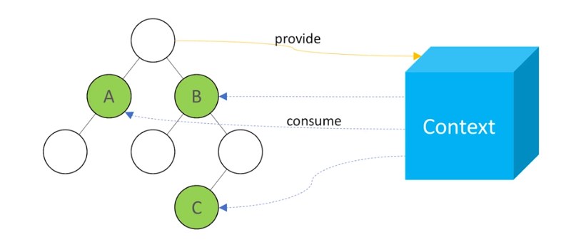

# 프론트엔드의 아키텍쳐?

> 아키텍처란 구조화 된 옷장과 비슷한 겁니다. 처음 개발 할 때에는 규칙없이 그냥 코드를 만들다 보면 덩치가 커지는 순간 불편함이 생기고 정리가 안 되는 시점이 생깁니다. 그러니 처음부터 특정한 규칙을 만들어서 개발을 하는게 좋다는 것을 알게 되고 규칙을 하나씩 만들어가며 개발을 하다보면 이것이 반복이 되어 하나의 특정 패턴이 만들어집니다. 이러한 패턴들을 모두가 이해하고 따를 수 있도록 하는 구조를 아키텍쳐라고 부릅니다. [(https://velog.io/@teo)](https://velog.io/@teo)

## MVC Pattern

- Model (데이터)
- View (화면)
- Controller (컨트롤러)

Model의 데이터를 받아서 화면에 그리고, 화면으로부터 사용자의 동작을 받아서 Model을 변경한다. Model과 View 사이 중간 역할을 Controller가 수행한다. `Model과 View간의 의존관계를 최소화` 해서 화면의 수정이 데이터수정에 영향을 미치지 않고 데이터 수정이 화면의 수정에 영향을 미치지 않고자 함이다

## MVVM Pattern

- Model
- View
- ViewModel

컨트롤러의 반복적인 기능이 선언적인 방식으로 개선되었다. Model과 View의 관점을 분리하지 않고 `하나의 템플릿`으로 관리한다.

## Container-Presenter Pattern

- Container: 비즈니스 로직을 관장하는 컴포넌트
- Presenter: 데이터만 뿌려주는 컴포넌트

화면단위가 아닌 더 작게 `재사용` 할 수 있는 단위(`Component`)로 만들어서 조립하는 방식이다.

### Container-Presenter 패턴의 한계: Props Drilling Problem

컴포넌트 구조가 복잡해지며 하위에 특정값을 전달하기 위해서는 중간레벨의 컴포넌트가 전부 props를 가져야 하는 문제가 발생한다.

- Props Drilling Problem

## FLUX Pattern

컴포넌트의 재사용성과 독립성을 지나치게 강조하니 같은 데이터를 공유하는 과정에서 props를 통해 데이터를 전달하는 과정에 Model의 관리가 파편화되는 문제가 있다.

이러한 Props Drilling Problem을 해결하기 위한 새로운 아키텍쳐 FLUX패턴은 MVC의 개념에서 벗어난 단방향 아키텍쳐(uni-directional architecture)이다.

기존의 컴포넌트를 지향하는 MVC가 아니라 View를 하나의 범주로 두고 View에서 `Action`을 호출하면 `Dispatcher`를 통해 `Store`라는 공간에 Data가 보관이 되고 다시 뷰로 전달되는 흐름을 설명한다.

  
- MVC와 FLUX

### Redux

Redux는 FLUX 패턴을 이용한 구현체이다. FLUX 패턴은 View를 각각의 MVC 컴포넌트 관점으로 보는 것이 아니라 하나의 큰 View로 이해하고 View에서는 Dispatch를 통해서 Action을 전달하면 Action은 Reducer를 통해서 Data가 Store에 보관이 되고 Store에 들어있는 데이터는 다시 View로 연결이 되는 방식이다.

공통적으로 사용되는 비즈니스 로직의 layer와 View의 layer를 완전히 분리시켜 상태관리라는 방식으로 관리한다. 각각의 독립된 컴포넌트가 아닌 하나의 거대한 View 영역으로 간주한다. 둘 사이의 관계는 Action과 Reducer 라는 인터페이스로 분리, Controller는 양방향이 아닌 단방향 Cycle을 이루도록 설계되었다. Redux, Vuex 등이 대표적인 상태관리 라이브러리이다.

- Props Drilling Problem & Redux

### FLUX 패턴의 한계

간단한 구조에서는 Props Drilling Problem이 치명적이지 않다. 하지만 상태를 관리하기 위해서 Action, Dispatch, Reducer를 만들고 관리하는데 들어가는 많은 부수적인 코드들로 인해 관리가 어려워진다.

## Observer-Observable Pattern

Props Drilling Problem 문제를 다른 식으로 푼 패턴이다. FLUX와 동일하게 거대한 View와 상태관리인 Model을 나누는 관점은 동일하다. 복잡함을 야기하는 Dispatch와 Action을 배제하고 값이 바뀌면 바뀐 값을 모두에게 전달을 한다는 개념이다.

초창기 Mobx가 이러한 방식을 기반으로 하되 Redux의 영향을 받아 용어는 Action과 Reaction이라는 방식을 취했다.

## MVI Pattern

- Model
- View
- Intent

기존 FLUX 패턴을 Dispatch, Action, Update의 인터페이스를 전부 Observable를 이용한 스트림(Stream)의 방식으로 만들었다. 비동기 문제를 해결하고 장황한 문법을 하나의 인터페이스로 통일시켰다.

## 그 외

### React-Query - MVC의 개념 확대

React-Query는 이러한 상태관리에 편향되어 있던 시각에서 벗어나 고전적인 ajax의 데이터를 Model로 간주한다. 대부분의 프론트엔드 개발은 서버 데이터를 CRUD하고 시각으로 그리는 것에 중점이 되어 있는데 FLUX나 Atomic은 너무 복잡한 방법이라는 것이다.

- Model: 서버와의 fetch 영역
- View: 리액트
- Controller: query와 mutation이라는 2가지의 인터페이스를 통해 서버데이터의 상태를 관리하고 캐싱, 동기화, refetch 등을 관리하는 역할

### Atomic 패턴 - Recoil, Svelte Store, Vue Composition, jotai

- View와 Model은 분리
- 중간의 과정은 자율에 맡기고 간단하게 Model에 접근하는 법만 제공
- 동기화, 동시성 처리가 중요

### Context와 hook, props 상속

Props Drilling Problem이 문제라면 새로운 개념을 만들기보다 props만 새로 뚫지 않는 방법등을 제공하면 되지 않느냐는 시각이다. 컴포넌트 트리에서 Context라는 거대한 공통 조상을 만들고 그 Context로 부터 데이터를 제공을 받는 방식이다. 개념적으로는 별도의 Store를 두는 FLUX와 비슷한 느낌이 있어서 최근에는 복잡한 문법을 가지고 만들어야 하는 Redux보다는 React의 기본 기능인 Context API를 쓰겠다는 움직임이 생기고 있다.

#### Reference

- [https://velog.io/@teo](https://velog.io/@teo/%ED%94%84%EB%A1%A0%ED%8A%B8%EC%97%94%EB%93%9C%EC%97%90%EC%84%9C-MV-%EC%95%84%ED%82%A4%ED%85%8D%EC%B3%90%EB%9E%80-%EB%AC%B4%EC%97%87%EC%9D%B8%EA%B0%80%EC%9A%94)

- CreatedAt 2022.12.16

---

[Back](../README.md)
